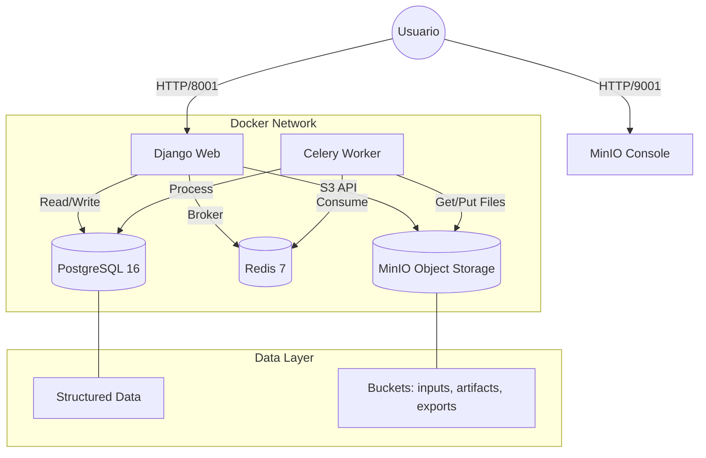

# 📊 PA vs SV - Sistema de Análisis de Personal

Sistema web para el análisis comparativo entre **Personal Asignado (PA)** y **Servicio Vivo (SV)** de Liderman. Permite cargar archivos Excel, procesarlos automáticamente y visualizar métricas en un dashboard interactivo.


---

## 📋 Índice

- [Características](#-características)
- [Arquitectura](#-arquitectura)
- [Tecnologías](#-tecnologías)
- [Instalación](#-instalación)
- [Uso](#-uso)
- [Reporte de Costos AWS](docs/AWS_COST_REPORT.md)
- [Manual de Usuario](docs/USER_MANUAL.md)
- [API Endpoints](#-api-endpoints)
- [Estructura del Proyecto](#-estructura-del-proyecto)
- [Diagramas](#-diagramas)

---

## ✨ Características

### 🎯 Funcionalidades Principales

| Característica | Descripción |
|----------------|-------------|
| **Upload de archivos** | Drag & drop para cargar archivos PA y SV en formato Excel/CSV |
| **Procesamiento automático** | Análisis y cruce de datos usando Polars |
| **Dashboard interactivo** | 6 pestañas con KPIs, gráficos y tablas |
| **Multi-tenant** | Soporte para múltiples organizaciones aisladas |
| **Filtros avanzados** | Macro Zona, Zona, Compañía, Grupo, Sector, Gerente |
| **Exportación Excel** | Descarga de resultados procesados |
| **Comparación histórica** | Comparar métricas entre períodos |

### 📈 Métricas Calculadas

- **Personal Asignado (PA)**: Total de personal asignado
- **Servicio Vivo (SV)**: Personal estimado según planificación
- **Diferencia**: PA - SV
- **Cobertura**: (SV/PA) × 100%
- **% Diferencial**: (Diferencia/SV) × 100%
- **Estados**: SOBRECARGA, FALTA, EXACTO, NO_PLANIFICADO, SIN_PERSONAL, SIN_DATOS

---

## 🏗️ Arquitectura

### Diagrama de Contenedores (Docker)



---

## 🛠️ Tecnologías

### Backend & Procesamiento
| Tecnología | Versión | Uso |
|------------|---------|-----|
| **Python** | 3.11+ | Lenguaje principal |
| **Django** | 5.x | Framework web (API + Admin) |
| **Celery** | 5.x | Cola de tareas asíncronas |
| **Polars** | 1.x | Procesamiento eficiente de datos |

### Infraestructura (Docker)
| Servicio | Imagen | Puerto Host | Descripción |
|----------|--------|-------------|-------------|
| **Web** | `python:3.11-slim` | 8001 | Aplicación Django + Gunicorn (dev) |
| **Worker** | `python:3.11-slim` | - | Worker de Celery para tareas pesadas |
| **Redis** | `redis:7-alpine` | 6379 | Message Broker & Result Backend |
| **PostgreSQL** | `postgres:16` | 5432 | Base de datos relacional |
| **MinIO** | `minio/minio:latest` | 9000 (API), 9001 (UI) | Almacenamiento de objetos (S3 Compatible) |

### Frontend
- **HTML5/CSS3** (Tailwind CSS via CDN)
- **JavaScript ES6+**
- **ECharts** (Visualización de datos)

### Almacenamiento (MinIO Buckets)
- `pavssv-inputs`: Archivos crudos subidos por el usuario (PA, SV).
- `pavssv-artifacts`: Archivos intermedios y resultados del procesamiento.
- `pavssv-exports`: Archivos finales disponibles para descarga pública/privada.

---

## 🚀 Instalación

### Prerrequisitos

- Python 3.11 o superior
- pip (gestor de paquetes Python)
- Git

### Pasos de Instalación

### Pasos de Instalación (Docker - Recomendado)

```bash
# 1. Clonar el repositorio
git clone https://github.com/tu-usuario/pavssv.git
cd pavssv/server

# 2. Configurar variables de entorno
cp .env.example .env
# Nota: Docker Compose gestionará la mayoría de variables, pero asegúrate 
# de que las credenciales de DB y MinIO coincidan.

# 3. Iniciar contenedores
docker-compose up -d --build

# 4. Verificar servicios
docker-compose ps
```

### Instalación Manual (Desarrollo Local sin Docker)

Si prefieres ejecutarlo localmente sin Docker (requiere Python 3.11+, un servidor Redis y Postgres/SQLite local):

```bash
cd server
python -m venv venv
# Windows
venv\Scripts\activate
# Linux/Mac
source venv/bin/activate

pip install -r requirements.txt
python manage.py migrate
python manage.py runserver 8001
```

### Acceso

- **Dashboard**: http://localhost:8001/dashboard/
- **Admin**: http://localhost:8001/admin/
- **API**: http://localhost:8001/api/v1/

---

## 📖 Uso

### 1. Subir Archivos

1. Navegar a `/dashboard/upload/`
2. Arrastrar archivo de **Personal Asignado** (PA)
3. Arrastrar archivo de **Servicio Vivo** (SV)
4. Seleccionar el período (mes/año)
5. Click en "Procesar Archivos"

### 2. Ver Dashboard

1. Navegar a `/dashboard/`
2. Seleccionar período en el dropdown
3. Usar filtros para segmentar datos
4. Navegar entre pestañas:
   - **Resumen**: KPIs y gráficos principales
   - **Por Cliente**: Tabla detallada por cliente
   - **Por Unidad**: Análisis por unidad de negocio
   - **Por Servicio**: Desglose por servicio
   - **Gráficos**: Visualizaciones adicionales
   - **Detalle Completo**: Datos granulares

### 3. Exportar Resultados

- Click en botón "📥 Excel" para descargar el análisis completo

---

## 🔌 API Endpoints

### Jobs API (`/api/v1/jobs/`)

| Método | Endpoint | Descripción |
|--------|----------|-------------|
| `POST` | `/api/v1/jobs/` | Crear nuevo job de análisis |
| `GET` | `/api/v1/jobs/<id>/status/` | Consultar estado del job |
| `GET` | `/api/v1/jobs/<id>/excel/` | Descargar Excel del job |
| `GET` | `/api/v1/jobs/latest/download/` | Descargar último Excel |

### Dashboard API (`/dashboard/api/`)

| Método | Endpoint | Descripción |
|--------|----------|-------------|
| `GET` | `/dashboard/api/metrics/` | Métricas del período seleccionado |
| `GET` | `/dashboard/api/periods/` | Períodos disponibles |
| `GET` | `/dashboard/api/compare/` | Comparar dos períodos |
| `GET` | `/dashboard/api/details/` | Datos detallados paginados |

### Parámetros Comunes

```
?tenant=<slug>        # Identificador del tenant
?period=<YYYY-MM>     # Período a consultar
```

---

## 📁 Estructura del Proyecto

```
Project_PAvsSV/
├── server/                     # Backend Django
│   ├── pavssv_server/          # Configuración principal
│   │   ├── settings.py         # Configuraciones Django
│   │   ├── urls.py             # URLs raíz
│   │   └── wsgi.py             # WSGI config
│   │
│   ├── tenants/                # App de multi-tenancy
│   │   ├── models.py           # Tenant, Membership
│   │   └── views.py
│   │
│   ├── jobs/                   # App de procesamiento
│   │   ├── models.py           # AnalysisJob, Artifact, Snapshot
│   │   ├── views.py            # JobCreateView, JobStatusView
│   │   ├── urls.py
│   │   └── services/
│   │       └── analysis_service.py
│   │
│   ├── dashboard/              # App de visualización
│   │   ├── views.py            # DashboardView, MetricsAPIView
│   │   ├── urls.py
│   │   └── templates/
│   │       └── dashboard/
│   │           ├── main.html   # Dashboard principal
│   │           └── upload.html # Página de upload
│   │
│   ├── api_v1/                 # API REST
│   │   ├── views.py
│   │   └── urls.py
│   │
│   ├── media/                  # Archivos subidos
│   │   └── tenants/
│   │       └── {slug}/
│   │           └── jobs/
│   │
│   ├── manage.py
│   ├── requirements.txt
│   ├── Dockerfile
│   └── docker-compose.yml
│
├── docs/                       # Documentación
│   ├── ARCHITECTURE.md
│   ├── API.md
│   └── images/
│
├── venv/                       # Entorno virtual
└── README.md                   # Este archivo
```

---

## 📊 Diagramas

Ver documentación detallada en:
- [Arquitectura y Flujos](docs/ARCHITECTURE.md)
- [Documentación API](docs/API.md)
- [Reporte de Costos AWS](docs/AWS_COST_REPORT.md)
- [Manual de Usuario](docs/USER_MANUAL.md)

---

## 🐳 Infraestructura Docker

El proyecto está totalmente contenerizado para facilitar el despliegue y desarrollo.

### Servicios
| Servicio | Puerto Host | Descripción |
|----------|-------------|-------------|
| **Web (Django)** | `8001` | Aplicación principal. Acceso: http://localhost:8001 |
| **MinIO Console**| `9001` | Dashboard S3. Acceso: http://localhost:9001 |
| **MinIO API** | `9000` | Endpoint S3 para clientes/SDKs |
| **PostgreSQL** | `5432` | Base de datos (mapeada a 5432 or 5433 si hay conflictos) |
| **Redis** | `6379` | Broker para Celery |

### Comandos Rápidos

```bash
# 1. Levantar servicios en segundo plano
docker-compose up -d --build

# 2. Ver logs del servidor web
docker-compose logs -f web

# 3. Ver logs del worker (procesamiento)
docker-compose logs -f worker

# 4. Crear superusuario (dentro del contenedor web)
docker-compose exec web python manage.py createsuperuser
```

### URLs de Acceso
- **Dashboard**: http://localhost:8001/dashboard/
- **Admin**: http://localhost:8001/admin/
- **MinIO Console**: http://localhost:9001 (User: `minioadmin`, Pass: `minioadmin123`)

---

## 🔐 Seguridad

### Autenticación
- **JWT**: Para APIs externas (REST clients, móvil)
- **Session**: Para dashboard interno (navegador)
- CORS configurado para dominios permitidos

### Roles y Permisos

| Rol | Ver | Subir | Eliminar | Exportar |
|-----|-----|-------|----------|----------|
| Owner | ✅ | ✅ | ✅ | ✅ |
| Admin | ✅ | ✅ | ✅ | ✅ |
| Coordinator | ✅ | ✅ | ✅ | ✅ |
| Analyst | ✅ | ❌ | ❌ | ✅ |
| Viewer | ✅ | ❌ | ❌ | ❌ |

### Otras medidas
- Aislamiento de datos por tenant
- Validación de archivos en upload
- CSRF protection habilitado

---

## 🤝 Contribución

1. Fork el proyecto
2. Crear rama feature (`git checkout -b feature/nueva-funcionalidad`)
3. Commit cambios (`git commit -m 'Agregar nueva funcionalidad'`)
4. Push a la rama (`git push origin feature/nueva-funcionalidad`)
5. Crear Pull Request

---

## 📄 Licencia

Este proyecto es propietario de Liderman. Todos los derechos reservados.

---

## 📞 Soporte

Para soporte técnico, contactar a:
- Email: soporte@liderman.com.pe
- Documentación interna: [Wiki Liderman]

---

*Desarrollado con ❤️ para Liderman*
