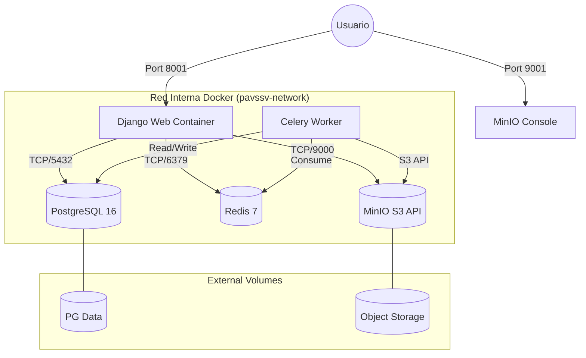
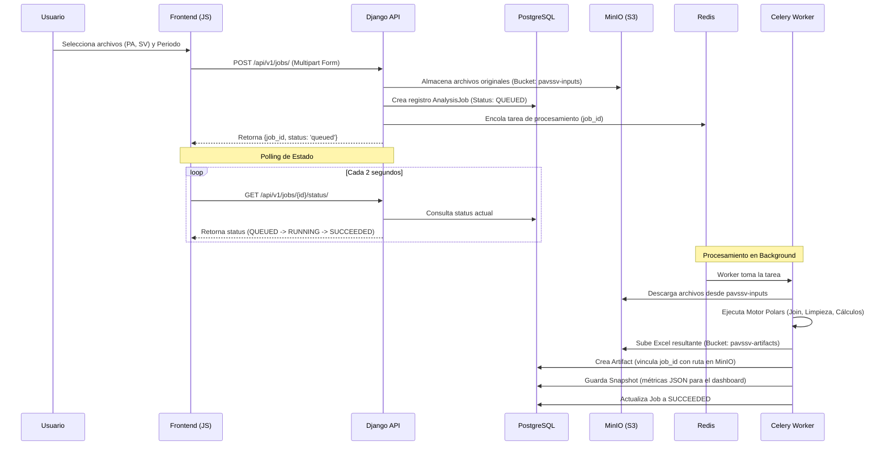
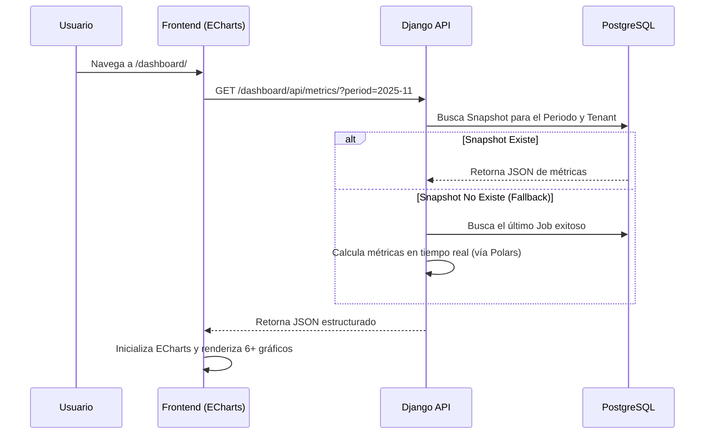
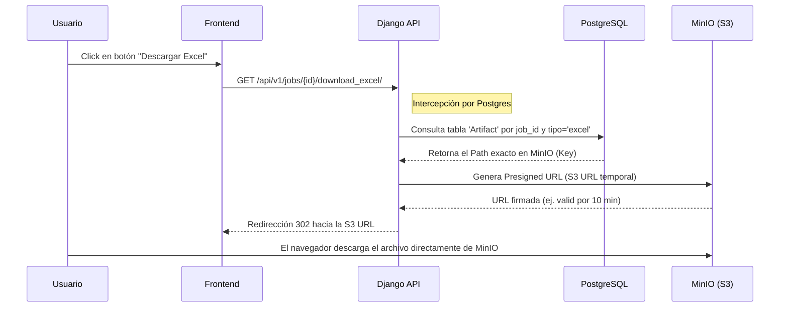

# 🏗️ Arquitectura del Sistema PA vs SV

Este documento describe la arquitectura técnica, los componentes de infraestructura y los flujos de datos detallados del sistema.

---

## 📐 Topología de Servicios (Docker Network)

El sistema opera en un entorno de contenedores aislados que se comunican a través de una red interna de Docker.



### Detalle de Puertos y Servicios
| Servicio | Host Port | Internal Port | Protocolo | Uso |
|----------|-----------|---------------|-----------|-----|
| **Web** | 8001 | 8000 | HTTP | Aplicación Django (API + Dashboard) |
| **PostgreSQL**| 5432 | 5432 | TCP | Base de Datos Relacional |
| **Redis** | 6379 | 6379 | TCP | Broker para Celery y Result Backend |
| **MinIO API** | 9000 | 9000 | HTTP | Almacenamiento S3 Compatible |
| **MinIO UI** | 9001 | 9001 | HTTP | Consola de administración de MinIO |

---

## 🧱 Capas del Sistema

### 1. Capa de Presentación (Frontend)
- **Tecnología**: HTML5, Vanilla JavaScript (ES6+), Tailwind CSS.
- **Visualización**: ECharts para gráficos dinámicos.
- **Comunicación**: Consume la Capa API mediante `fetch()` de forma asíncrona.

### 2. Capa de Aplicación y API (Django)
- **Django REST Framework**: Expone endpoints para la gestión de trabajos y métricas.
- **Gestión de Tenants**: Aislamiento de datos por empresa/cliente.
- **Control de Flujo**: Coordina la subida a MinIO y el encolado de tareas en Redis.

### 3. Capa de Procesamiento Asíncrono (Celery + Polars)
- **Worker**: Procesa archivos en segundo plano para no bloquear la UI.
- **Motor Polars**: Utilizado para realizar el cruce de datos (Join) entre PA y SV de forma eficiente en memoria.

### 4. Capa de Persistencia (PostgreSQL + MinIO)
- **PostgreSQL**: Almacena metadatos (Jobs, Artifacts, Snapshots, Tenants).
- **MinIO**: Almacena los archivos binarios (Excel de entrada y salida).

---```

---

## 🔄 Flujos de Datos Detallados

### 1. Flujo de Upload y Procesamiento Asíncrono
Este flujo describe cómo los archivos subidos por el usuario son procesados sin bloquear la interfaz.



### 2. Flujo de Visualización del Dashboard
Muestra cómo se recuperan las métricas pre-calculadas para una carga instantánea.



### 3. Flujo de Descarga de Reporte Excel
Este flujo es crítico: intercede por Postgres para obtener el índice del archivo antes de ir a MinIO.



---

## 🔀 Comportamiento por Capas

### Capa Frontend (Interfaz de Usuario)
- **main.js**: Coordina las llamadas a la API y la actualización del DOM.
- **charts.js**: Encapsula la lógica de configuración de ECharts para mantener el dashboard reactivo.
- **upload.js**: Gestiona el arrastre de archivos (Drag & Drop) y la barra de progreso mediante polling.

### Capa de Aplicación (Django)
- **Modelos**:
    - `Tenant`: Define el contexto de datos (Aislamiento Multi-empresa).
    - `AnalysisJob`: Rastrea el ciclo de vida de cada proceso de carga.
    - `Artifact`: Índice de archivos generados almacenados en MinIO.
    - `AnalysisSnapshot`: Caché de métricas agregadas en formato JSON para velocidad de lectura.
- **Middleware de Tenant**: Asegura que un usuario solo acceda a los datos de su propia empresa.

### Capa de Procesamiento (Polars Engine)
- **Normalización**: Convierte nombres de columnas heterogéneos a un estándar interno.
- **Cruce de Datos**: Realiza un `outer join` entre PA y SV usando `Num_Fotocheck` o `DNI` como llave primaria.
- **Lógica de Estados**: Clasifica cada registro como:
    - `COINCIDE`: Horas PA == Horas SV.
    - `SOBRECARGA`: Horas SV > Horas PA.
    - `FALTA`: Horas SV < Horas PA.
    - `SIN_SV`: Solo presente en PA.
    - `SIN_PA`: Solo presente en SV.

---

## 🔐 Seguridad e Integridad
- **Aislamiento S3**: Los buckets de MinIO están configurados de forma privada. El acceso solo es posible vía Presigned URLs generadas por el servidor.
- **Postgres Indexing**: Se utilizan índices sobre `(tenant_id, period_month)` y `(job_id)` para asegurar que las búsquedas de archivos y métricas sean constantes (O(1) o O(log n)) independientemente del volumen de datos.

---

## 📈 Escalabilidad
- **Horizontal**: Los `Celery Workers` pueden escalarse de forma independiente para procesar múltiples cargas simultáneas.
- **Vertical**: El uso de `Polars` permite procesar archivos de 1M+ de filas utilizando múltiples hilos (Multi-threading) de forma nativa.

---

*Documentación actualizada: 05 de Enero de 2026*
