# 🚀 Informe de Despliegue a Producción - PA vs SV

## Resumen Ejecutivo

Este informe detalla las opciones y pasos necesarios para desplegar el sistema **PA vs SV** a un entorno de producción. El proyecto está preparado para despliegue con Docker y soporta tanto AWS como ambientes on-premise.

---

## 📊 Opciones de Despliegue

### Opción A: Amazon ECS (Fargate) - ⭐ Recomendado

| Aspecto | Detalle |
|---------|---------|
| **Gestión** | Serverless (sin administración de servidores) |
| **Escalabilidad** | Automática |
| **Alta Disponibilidad** | Nativa |
| **Costo Estimado** | ~$95/mes |
| **Mantenimiento** | Mínimo |

> **Ideal para:** Producción empresarial con SLA alto.

---

### Opción B: Amazon EC2 (Instancia Única)

| Aspecto | Detalle |
|---------|---------|
| **Gestión** | Manual (Docker Compose) |
| **Escalabilidad** | Manual |
| **Costo Estimado** | ~$30-50/mes |
| **Mantenimiento** | Requiere administrador |

> **Ideal para:** Desarrollo, staging, o bajo tráfico.

---

## 💰 Costos Estimados AWS (Mensual)

| Servicio | Configuración | Costo Est. |
|----------|---------------|------------|
| **Compute (Fargate)** | 2 tasks (0.5 vCPU, 1GB RAM) | ~$35.00 |
| **Database (RDS)** | db.t4g.micro (20GB SSD) | ~$25.00 |
| **Cache (ElastiCache)** | cache.t4g.micro | ~$12.00 |
| **Storage (S3)** | 50GB + 10k operaciones | ~$3.00 |
| **Networking (ALB)** | 1 ALB + 10GB transfer | ~$20.00 |
| **Total** | | **~$95.00** |

> [!TIP]
> Con **AWS Free Tier** (cuenta nueva), gran parte de estos costos se cubren durante los primeros 12 meses.

---

## 🏗️ Arquitectura de Producción

```mermaid
flowchart TB
    subgraph AWS["☁️ AWS Cloud"]
        
        subgraph Public["Capa Pública"]
            R53["🌐 Route 53<br/>pavssv.liderman.com"]
            ALB["⚖️ ALB<br/>SSL/TLS"]
            WAF["🛡️ WAF + Shield"]
        end
        
        subgraph ECS["📦 ECS Cluster - Fargate"]
            WEB["🌐 Web Task<br/>Django"]
            WORKER["⚙️ Worker Task<br/>Celery"]
        end
        
        subgraph VPC["🔒 VPC Privada"]
            RDS["🐘 RDS<br/>PostgreSQL"]
            REDIS["⚡ ElastiCache<br/>Redis"]
            S3["📂 S3<br/>Buckets"]
        end
        
    end
    
    USER["👤 Usuario"] --> R53
    R53 --> ALB
    ALB --> WAF
    ALB --> WEB
    ALB --> WORKER
    WEB --> RDS
    WEB --> REDIS
    WEB --> S3
    WORKER --> RDS
    WORKER --> REDIS
    WORKER --> S3

    style AWS fill:#232F3E,stroke:#FF9900,stroke-width:2px,color:#fff
    style Public fill:#3F8624,stroke:#fff,stroke-width:1px,color:#fff
    style ECS fill:#FF9900,stroke:#232F3E,stroke-width:2px,color:#000
    style VPC fill:#1A73E8,stroke:#fff,stroke-width:1px,color:#fff
```



---

## 📋 Pasos de Despliegue

### Fase 1: Preparación de Infraestructura AWS

```bash
# 1. Crear VPC y subnets
aws cloudformation create-stack \
  --stack-name pavssv-network \
  --template-body file://infra/vpc.yaml

# 2. Crear RDS PostgreSQL
aws rds create-db-instance \
  --db-instance-identifier pavssv-db \
  --db-instance-class db.t4g.micro \
  --engine postgres \
  --engine-version 16 \
  --master-username pavssv_admin \
  --master-user-password "SECURE_PASSWORD" \
  --allocated-storage 20

# 3. Crear ElastiCache Redis
aws elasticache create-cache-cluster \
  --cache-cluster-id pavssv-redis \
  --cache-node-type cache.t4g.micro \
  --engine redis \
  --num-cache-nodes 1

# 4. Crear buckets S3
aws s3 mb s3://pavssv-inputs
aws s3 mb s3://pavssv-artifacts
aws s3 mb s3://pavssv-exports
```

---

### Fase 2: Configurar Secretos

```bash
# Crear secreto para Django
aws secretsmanager create-secret \
  --name pavssv/production/django \
  --secret-string '{"SECRET_KEY":"GENERAR_CLAVE_SEGURA_DE_50_CHARS"}'

# Crear secreto para Database
aws secretsmanager create-secret \
  --name pavssv/production/database \
  --secret-string '{"username":"pavssv_admin","password":"SECURE_PASSWORD","host":"pavssv-db.xxxxx.us-east-1.rds.amazonaws.com","port":"5432","dbname":"pavssv"}'
```

---

### Fase 3: Build y Push de Imagen Docker

```bash
# 1. Autenticarse en ECR
aws ecr get-login-password --region us-east-1 | \
  docker login --username AWS --password-stdin ACCOUNT_ID.dkr.ecr.us-east-1.amazonaws.com

# 2. Crear repositorio ECR (si no existe)
aws ecr create-repository --repository-name pavssv

# 3. Build de imagen de producción
docker build -t pavssv:production -f server/Dockerfile .

# 4. Tag y push
docker tag pavssv:production ACCOUNT_ID.dkr.ecr.us-east-1.amazonaws.com/pavssv:production
docker push ACCOUNT_ID.dkr.ecr.us-east-1.amazonaws.com/pavssv:production
```

---

### Fase 4: Desplegar en ECS

```bash
# 1. Crear cluster ECS
aws ecs create-cluster --cluster-name pavssv-cluster

# 2. Registrar task definition (web)
aws ecs register-task-definition \
  --cli-input-json file://ecs/web-task-definition.json

# 3. Registrar task definition (worker)
aws ecs register-task-definition \
  --cli-input-json file://ecs/worker-task-definition.json

# 4. Crear servicio web
aws ecs create-service \
  --cluster pavssv-cluster \
  --service-name pavssv-web \
  --task-definition pavssv-web:1 \
  --desired-count 2 \
  --launch-type FARGATE

# 5. Crear servicio worker
aws ecs create-service \
  --cluster pavssv-cluster \
  --service-name pavssv-worker \
  --task-definition pavssv-worker:1 \
  --desired-count 1 \
  --launch-type FARGATE
```

---

### Fase 5: Configurar ALB y DNS

```bash
# 1. Crear Application Load Balancer
aws elbv2 create-load-balancer \
  --name pavssv-alb \
  --subnets subnet-public-1 subnet-public-2 \
  --security-groups sg-alb

# 2. Crear certificado SSL
aws acm request-certificate \
  --domain-name pavssv.liderman.com \
  --validation-method DNS

# 3. Configurar Route 53
aws route53 change-resource-record-sets \
  --hosted-zone-id ZONE_ID \
  --change-batch file://dns/pavssv-record.json
```

---

## ✅ Checklist de Seguridad Pre-Producción

### Configuración Django (`settings.py`)

- [ ] `DEBUG = False`
- [ ] `SECRET_KEY` en AWS Secrets Manager
- [ ] `ALLOWED_HOSTS` = dominio de producción
- [ ] `SECURE_SSL_REDIRECT = True`
- [ ] `SESSION_COOKIE_SECURE = True`
- [ ] `CSRF_COOKIE_SECURE = True`
- [ ] `SECURE_HSTS_SECONDS = 31536000`

### Base de Datos

- [ ] Conexión SSL habilitada
- [ ] Usuario con permisos mínimos
- [ ] Backups automáticos
- [ ] Security Group restringido

### Almacenamiento S3

- [ ] Encriptación AES-256
- [ ] Block Public Access habilitado
- [ ] URLs prefirmadas con expiración 1h
- [ ] IAM roles con mínimos privilegios

### Infraestructura

- [ ] WAF configurado
- [ ] Rate limiting habilitado
- [ ] CloudWatch Logs activo
- [ ] Alertas configuradas

---

## 🔧 Variables de Entorno de Producción

```bash
# ================================
# Django
# ================================
DJANGO_SECRET_KEY=<desde Secrets Manager>
DJANGO_DEBUG=0
DJANGO_ALLOWED_HOSTS=pavssv.liderman.com

# ================================
# Database (RDS)
# ================================
POSTGRES_DB=pavssv
POSTGRES_USER=<desde Secrets Manager>
POSTGRES_PASSWORD=<desde Secrets Manager>
POSTGRES_HOST=pavssv-db.xxxxx.rds.amazonaws.com
POSTGRES_PORT=5432

# ================================
# S3 Storage (AWS)
# ================================
USE_S3_STORAGE=true
AWS_ACCESS_KEY_ID=<IAM Role preferido>
AWS_SECRET_ACCESS_KEY=<IAM Role preferido>
AWS_S3_REGION_NAME=us-east-1
AWS_STORAGE_BUCKET_NAME=pavssv-artifacts
AWS_INPUTS_BUCKET=pavssv-inputs
AWS_EXPORTS_BUCKET=pavssv-exports
# NO incluir AWS_S3_ENDPOINT_URL para usar S3 real

# ================================
# Celery
# ================================
CELERY_BROKER_URL=redis://pavssv-redis.xxxxx.cache.amazonaws.com:6379/0
CELERY_RESULT_BACKEND=redis://pavssv-redis.xxxxx.cache.amazonaws.com:6379/1

# ================================
# Security
# ================================
SECURE_SSL_REDIRECT=true
CORS_ALLOWED_ORIGINS=https://pavssv.liderman.com
CSRF_TRUSTED_ORIGINS=https://pavssv.liderman.com
```

---

## 🔄 Alternativa: Despliegue EC2 Simple

Para un despliegue más simple usando Docker Compose en una instancia EC2:

```bash
# 1. Crear instancia EC2 t3.medium
aws ec2 run-instances \
  --image-id ami-0c7217cdde317cfec \
  --instance-type t3.medium \
  --key-name mi-key \
  --security-group-ids sg-xxxxx \
  --subnet-id subnet-xxxxx

# 2. SSH a la instancia e instalar Docker
ssh -i mi-key.pem ubuntu@IP_PUBLICA
sudo apt update && sudo apt install -y docker.io docker-compose

# 3. Clonar repositorio
git clone https://github.com/liderman/pavssv.git
cd pavssv/server

# 4. Configurar .env para producción
cp .env.example .env
nano .env  # Configurar variables de producción

# 5. Levantar servicios
docker-compose up -d --build

# 6. Verificar
docker-compose ps
curl http://localhost:8001/api/v1/health/
```

---

## ✔️ Verificación Post-Despliegue

```bash
# 1. Verificar health check
curl https://pavssv.liderman.com/api/v1/health/

# 2. Verificar headers de seguridad
curl -I https://pavssv.liderman.com/api/v1/health/

# 3. Verificar dashboard
# Abrir en navegador: https://pavssv.liderman.com/dashboard/
```

### Crear Superusuario (primera vez)

**En ECS:**
```bash
aws ecs execute-command \
  --cluster pavssv-cluster \
  --task TASK_ID \
  --container web \
  --interactive \
  --command "python manage.py createsuperuser"
```

**En EC2:**
```bash
docker-compose exec web python manage.py createsuperuser
```

---

## 📞 Soporte

Para asistencia con el despliegue:

| Recurso | Enlace |
|---------|--------|
| 📧 **Email** | [soporte@liderman.com.pe](mailto:soporte@liderman.com.pe) |
| 📄 **Documentación de Seguridad** | [SECURITY_DEPLOYMENT_CHECKLIST.md](./SECURITY_DEPLOYMENT_CHECKLIST.md) |
| 💰 **Costos AWS** | [AWS_COST_REPORT.md](./AWS_COST_REPORT.md) |

---

> [!IMPORTANT]
> Antes de desplegar a producción, asegúrese de completar todos los items del **Checklist de Seguridad** y revisar la documentación de seguridad completa.