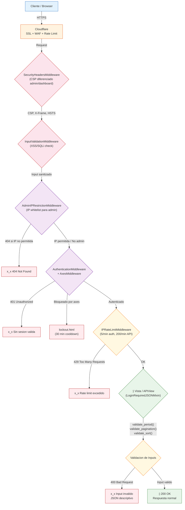

# 🛡️ Guía de Security Hardening — Django / FastAPI / Flask

> **Proyecto**: Dashboard PA vs SV — Liderman  
> **Fecha**: 12 de febrero de 2026  
> **Stack**: Django 4.x + Gunicorn + WhiteNoise + Cloudflare  
> **Autor**: Esteban Cabrera Arbizu

---

## 📋 Resumen Ejecutivo

Este documento recopila **7 observaciones de seguridad** identificadas durante una auditoría del proyecto Dashboard PA vs SV, las correcciones implementadas, y cómo aplicar cada patrón en **Django**, **FastAPI** y **Flask** para futuros proyectos.

| Obs | Severidad    | Problema                        | Estado                    |
|-----|--------------|---------------------------------|---------------------------|
| 1   | Info         | Dominio `.net.pe` (dev) en prod | ⏳ Pendiente (Sistemas)   |
| 2   | **Grave**    | APIs sin autenticación          | ✅ Corregido (LoginRequiredJSONMixin) |
| 3   | **Grave**    | Input inválido → Error 500      | ✅ Corregido (validate_period/pagination/sort) |
| 4   | **Crítica**  | Sesión no verificada            | ✅ Corregido (__Host- cookies, 15 min TTL) |
| 5   | Baja         | CSRF cookie sin HttpOnly        | ✅ Aceptado (necesario para Django admin AJAX) |
| 6   | Media        | CSP con `unsafe-inline`         | ✅ Corregido (CSP diferenciado admin/dashboard) |
| 7   | Media        | `/admin/` expuesto públicamente | ✅ Corregido (AdminIPRestrictionMiddleware + URL personalizable + CAPTCHA + axes) |

---

## 🏗️ Arquitectura de Seguridad — Request Flow



## 📊 Resumen de Fixes por Observación

```mermaid
flowchart LR
    subgraph OBS2["Obs 2 -- API Authentication"]
        A1["LoginRequiredJSONMixin"] --> A2["Todas las APIs\nprotegidas"]
        A2 --> A3["401 si no hay sesion"]
    end

    subgraph OBS3["Obs 3 -- Input Validation"]
        B1["validate_period()\nregex YYYY-MM"] --> B2["try/except int()\nlimit, offset, page"]
        B2 --> B3["max/min clamping\nlimit=1..100"]
        B3 --> B4["400 Bad Request\nJSON error"]
    end

    subgraph OBS4["Obs 4 -- Session Security"]
        C1["__Host- cookies\n15 min TTL"] --> C2["LoginRequiredJSONMixin\nen todas las vistas"]
        C2 --> C3["SECRET_KEY obligatoria\nSin valor por defecto"]
    end

    subgraph OBS5["Obs 5 -- Cookie Security"]
        D1["SESSION_COOKIE_HTTPONLY=True"] --> D2["CSRF_COOKIE_HTTPONLY=False\n(necesario para AJAX)"]
        D2 --> D3["SameSite=Lax\nen ambas cookies"]
    end

    subgraph OBS6["Obs 6 -- CSP Headers"]
        E1["CSP_SCRIPT_SRC=\nself"] --> E2["Sin unsafe-inline\nSin unsafe-eval"]
        E2 --> E3["CSP diferenciado\nadmin vs dashboard"]
    end

    subgraph OBS7["Obs 7 -- Admin Protected"]
        F1["URL personalizable\nDJANGO_ADMIN_URL"] --> F2["AdminIPRestriction\n+ axes + CAPTCHA"]
        F2 --> F3["404 Not Found\nsi IP no permitida"]
    end

    style OBS2 fill:#e8f5e9,stroke:#2e7d32
    style OBS3 fill:#e3f2fd,stroke:#1565c0
    style OBS4 fill:#f3e5f5,stroke:#6a1b9a
    style OBS5 fill:#fff3e0,stroke:#e65100
    style OBS6 fill:#fce4ec,stroke:#c62828
    style OBS7 fill:#f1f8e9,stroke:#33691e
```



## 🔄 Equivalencias de Seguridad: Django vs FastAPI vs Flask

```mermaid
graph TD
    subgraph Django["Django"]
        DJ1["SecurityHeadersMiddleware\nbuild_csp_header()"]
        DJ2["InputValidationMiddleware\ncheck XSS/SQLi patterns"]
        DJ3["LoginRequiredJSONMixin\npermission_classes"]
        DJ4["settings.py\nCSP_SCRIPT_SRC = self"]
        DJ5["validate_period()\ntry/except + regex"]
        DJ6["django-axes\nbrute force protection"]
    end

    subgraph FastAPI["FastAPI"]
        FA1["add_middleware()\nCSP/Security headers"]
        FA2["Depends validate_input\npydantic BaseModel"]
        FA3["Depends get_current_user\nOAuth2PasswordBearer"]
        FA4["starlette CSP middleware\nor custom middleware"]
        FA5["Pydantic validators\n@field_validator"]
        FA6["slowapi\nrate limiting"]
    end

    subgraph Flask["Flask"]
        FL1["flask-talisman\nCSP headers"]
        FL2["@app.before_request\ninput sanitization"]
        FL3["flask-login\n@login_required"]
        FL4["talisman config\ncsp script-src self"]
        FL5["marshmallow schemas\nvalidation"]
        FL6["flask-limiter\nrate limiting"]
    end

    DJ1 -.->|equivalente| FA1
    DJ1 -.->|equivalente| FL1
    DJ3 -.->|equivalente| FA3
    DJ3 -.->|equivalente| FL3
    DJ5 -.->|equivalente| FA5
    DJ5 -.->|equivalente| FL5

    style Django fill:#e8f5e9,stroke:#2e7d32
    style FastAPI fill:#e3f2fd,stroke:#1565c0
    style Flask fill:#fce4ec,stroke:#c62828
```



---

## 🔐 Obs 2 — Autenticación en APIs

### Problema
Todas las APIs (`metrics`, `clients`, `details`, `periods`, `services`, `units`, `compare`) eran accesibles sin autenticación. Cualquier persona con la URL podía ver datos sensibles.

### Solución implementada (Django)

Se creó un mixin `LoginRequiredJSONMixin` que retorna **401 JSON** en lugar de redirigir al login (necesario para APIs llamadas via AJAX):

```python
# dashboard/views.py
class LoginRequiredJSONMixin:
    """Retorna 401 JSON en lugar de redirigir al login."""
    def dispatch(self, request, *args, **kwargs):
        if not request.user.is_authenticated:
            return JsonResponse(
                {"error": {"code": "unauthorized", "message": "Autenticación requerida"}},
                status=401
            )
        return super().dispatch(request, *args, **kwargs)

# Se aplicó a TODAS las APIs del dashboard:
class MetricsAPIView(LoginRequiredJSONMixin, View): ...
class PeriodsAPIView(LoginRequiredJSONMixin, View): ...
class CompareAPIView(LoginRequiredJSONMixin, View): ...
class DetailsAPIView(LoginRequiredJSONMixin, View): ...
class ClientsAPIView(LoginRequiredJSONMixin, View): ...
class UnitsAPIView(LoginRequiredJSONMixin, View): ...
class ServicesAPIView(LoginRequiredJSONMixin, View): ...
```

Adicionalmente, se eliminó `@method_decorator(csrf_exempt)` de todas las vistas y se reemplazó `get_tenant_for_user()` para que retorne `None` (en lugar del tenant default) cuando el usuario no está autenticado.

### Verificación (13/13 endpoints retornan 401 sin sesión)

```javascript
// Test con Playwright — Sin sesión → 401
const r = await fetch('/dashboard/api/metrics/?tenant=default&period=2025-11');
console.log(r.status); // 401
console.log(await r.json()); 
// {"error": {"code": "unauthorized", "message": "Autenticación requerida"}}
```

### Implementación para futuros proyectos

<details>
<summary><strong>🐍 Django REST Framework</strong></summary>

```python
# settings.py — Configuración global
REST_FRAMEWORK = {
    'DEFAULT_AUTHENTICATION_CLASSES': [
        'rest_framework.authentication.SessionAuthentication',
        'rest_framework.authentication.TokenAuthentication',
    ],
    'DEFAULT_PERMISSION_CLASSES': [
        'rest_framework.permissions.IsAuthenticated',
    ],
}
```

</details>

<details>
<summary><strong>⚡ FastAPI</strong></summary>

```python
from fastapi import Depends, HTTPException, status
from fastapi.security import OAuth2PasswordBearer

oauth2_scheme = OAuth2PasswordBearer(tokenUrl="token")

async def get_current_user(token: str = Depends(oauth2_scheme)):
    user = decode_token(token)
    if not user:
        raise HTTPException(
            status_code=status.HTTP_401_UNAUTHORIZED,
            detail="Not authenticated",
            headers={"WWW-Authenticate": "Bearer"},
        )
    return user

@app.get("/api/metrics/")
async def metrics(user=Depends(get_current_user)):
    ...
```

</details>

<details>
<summary><strong>🌶️ Flask</strong></summary>

```python
from flask_login import login_required, current_user

@app.route('/api/metrics/')
@login_required
def metrics():
    ...
```

</details>

---

## 📋 Obs 3 — Validación de Inputs (400 vs 500)

### Problema
Inputs inválidos como `?period=sss` o `?limit=abc` causaban **Error 500** (Internal Server Error) expuesto por Cloudflare, revelando información del stack y consumiendo recursos.

### Solución implementada

#### Función reutilizable `validate_period()`

```python
import re

def validate_period(period_str):
    """Valida formato YYYY-MM. Retorna (year, month) o lanza ValueError."""
    if not period_str:
        raise ValueError("Se requiere el parámetro period")
    if not re.match(r'^\d{4}-\d{2}$', period_str):
        raise ValueError("Formato de periodo inválido. Use YYYY-MM")
    year, month = period_str.split('-')
    year, month = int(year), int(month)
    if not (2020 <= year <= 2030 and 1 <= month <= 12):
        raise ValueError("Periodo fuera de rango válido")
    return year, month
```

#### Uso en vistas

```python
# dashboard/views.py — MetricsAPIView
class MetricsAPIView(APIView):
    def get(self, request):
        period = request.query_params.get('period', '')
        try:
            validate_period(period)
        except ValueError as e:
            return Response(
                {"error": {"code": "invalid_param", "message": str(e)}},
                status=status.HTTP_400_BAD_REQUEST
            )
        # ... lógica normal
```

#### Validación de paginación con clamping

```python
# jobs/views.py — JobListView
class JobListView(APIView):
    def get(self, request):
        try:
            limit = int(request.query_params.get("limit", 20))
            offset = int(request.query_params.get("offset", 0))
        except (ValueError, TypeError):
            return Response(
                {"error": {"code": "invalid_param", 
                           "message": "limit y offset deben ser enteros"}},
                status=status.HTTP_400_BAD_REQUEST
            )
        limit = max(1, min(limit, 100))   # Clamp: 1 ≤ limit ≤ 100
        offset = max(0, offset)            # Clamp: offset ≥ 0
        
        jobs = AnalysisJob.objects.filter(tenant=tenant)
        total = jobs.count()
        jobs = jobs[offset:offset + limit]
        ...
```

### Resultados de verificación

| Input                    | Antes | Después                           |
|--------------------------|-------|-----------------------------------|
| `?period=sss`            | 500   | 400 `invalid_param`               |
| `?limit=abc`             | 500   | 400 `invalid_param`               |
| `?limit=-5`              | 500   | 200 (clamped a 1)                 |
| `?limit=999`             | 200   | 200 (capped a 100)               |
| `?offset=xyz`            | 500   | 400 `invalid_param`               |
| `?page=abc`              | 500   | 400 `invalid_param`               |
| `?search=<script>alert`  | 200   | 400 XSS bloqueado                 |
| `?period=' OR 1=1--`     | 500   | 400 SQL injection bloqueado       |

### Implementación para futuros proyectos

<details>
<summary><strong>⚡ FastAPI (Pydantic — validación automática)</strong></summary>

```python
from pydantic import BaseModel, Field, field_validator

class MetricsQuery(BaseModel):
    tenant: str
    period: str = Field(pattern=r'^\d{4}-\d{2}$')
    
    @field_validator('period')
    @classmethod
    def validate_period_range(cls, v):
        year, month = map(int, v.split('-'))
        if not (2020 <= year <= 2030 and 1 <= month <= 12):
            raise ValueError('Period out of range')
        return v

class PaginationQuery(BaseModel):
    limit: int = Field(default=20, ge=1, le=100)
    offset: int = Field(default=0, ge=0)

@app.get("/api/metrics/")
async def metrics(query: MetricsQuery = Depends()):
    ...  # Pydantic valida automáticamente → 422 si falla
```

</details>

<details>
<summary><strong>🌶️ Flask (Marshmallow)</strong></summary>

```python
from marshmallow import Schema, fields, validate, ValidationError

class MetricsSchema(Schema):
    tenant = fields.Str(required=True)
    period = fields.Str(required=True, validate=validate.Regexp(r'^\d{4}-\d{2}$'))
    page = fields.Int(load_default=1, validate=validate.Range(min=1))
    per_page = fields.Int(load_default=25, validate=validate.Range(min=1, max=100))

@app.route('/api/metrics/')
@login_required
def metrics():
    try:
        params = MetricsSchema().load(request.args)
    except ValidationError as err:
        return jsonify({"error": {"code": "invalid_param", "messages": err.messages}}), 400
    ...
```

</details>

---

## 🔑 Obs 4 — Seguridad de Sesión

### Problema
CSRF token y Session ID no se verificaban correctamente. Un atacante con tokens robados podía suplantar identidad.

### Solución implementada (actualizada 12 Feb 2026)

```python
# settings.py
# Expiración de sesiones y CSRF
SESSION_COOKIE_AGE = 900   # 15 minutos
CSRF_COOKIE_AGE = 900      # 15 minutos

# Cookies seguras (siempre activas, independiente de DEBUG)
SESSION_COOKIE_HTTPONLY = True
CSRF_COOKIE_HTTPONLY = False  # Necesario para Django admin AJAX
SESSION_COOKIE_SAMESITE = "Lax"
CSRF_COOKIE_SAMESITE = "Lax"

# Prefijo __Host- (requiere Secure + path=/) — solo en producción
SESSION_COOKIE_NAME = "__Host-sessionid"
CSRF_COOKIE_NAME = "__Host-csrftoken"

if not DEBUG:
    SESSION_COOKIE_SECURE = True
    CSRF_COOKIE_SECURE = True
else:
    # En desarrollo sin HTTPS, no usar prefijo __Host
    SESSION_COOKIE_NAME = "sessionid"
    CSRF_COOKIE_NAME = "csrftoken"
```

**SECRET_KEY ahora es obligatoria (sin valor por defecto):**

```python
# settings.py
SECRET_KEY = os.getenv("DJANGO_SECRET_KEY")
if not SECRET_KEY:
    raise ValueError(
        "DJANGO_SECRET_KEY no está configurada. "
        "Genera una con: python -c 'from django.core.management.utils import get_random_secret_key; print(get_random_secret_key())'"
    )
```

**Protección en las APIs del dashboard via `LoginRequiredJSONMixin`** (ver Obs 2).

### Para FastAPI

```python
from starlette.middleware.sessions import SessionMiddleware

app.add_middleware(
    SessionMiddleware,
    secret_key="your-secure-secret-key",
    session_cookie="session_id",
    max_age=3600,
    same_site="lax",
    https_only=True,
)
```

### Para Flask

```python
app.config.update(
    SESSION_COOKIE_HTTPONLY=True,
    SESSION_COOKIE_SECURE=True,
    SESSION_COOKIE_SAMESITE='Lax',
    PERMANENT_SESSION_LIFETIME=timedelta(hours=1),
)
```

---

## 🍪 Obs 5 — Cookies HttpOnly

### Estado actual (actualizado 12 Feb 2026)

| Cookie (producción) | HttpOnly | Secure | SameSite | Prefijo `__Host-` | Justificación |
|---------------------|----------|--------|----------|:-:|-|
| `__Host-sessionid`  | ✅ True  | ✅ True | Lax     | ✅ | No accesible desde JS, prefijo previene ataques de cookie tossing |
| `__Host-csrftoken`  | ❌ False | ✅ True | Lax     | ✅ | Necesario para Django admin AJAX (autocomplete, inline formsets, filtros dinámicos) |

### Verificación

```javascript
document.cookie  // "" → sessionid NO es accesible desde JavaScript
```

### Nota técnica
Si usas AJAX con CSRF, Django necesita leer el `csrftoken` desde una cookie o desde un `<meta>` tag. `HttpOnly=False` en `csrftoken` es aceptable porque un atacante necesitaría **ambos** `sessionid` + `csrftoken` para un ataque exitoso, y `sessionid` está protegido.

---

## 🔒 Obs 6 — Content Security Policy (CSP)

### Problema
CSP incluía `unsafe-inline` y `unsafe-eval` en `script-src`, permitiendo ejecución de scripts inyectados.

### Bug crítico encontrado: Tuple vs String en Python

```python
# ❌ ANTES — String, NO tuple (sin trailing comma)
CSP_SCRIPT_SRC = ("'self'")
# Python interpreta esto como un string
# Middleware hace: ' '.join("'self'") → "' s e l f '"  ← ¡caracteres separados!

# ✅ DESPUÉS — Tuple con trailing comma
CSP_SCRIPT_SRC = ("'self'",)
# Ahora es un tuple de 1 elemento
# Middleware hace: ' '.join(("'self'",)) → "'self'"  ← ¡correcto!
```

> **Lección**: En Python, `("valor")` es un **string**, `("valor",)` es un **tuple**. Siempre usar trailing comma en tuples de un solo elemento.

### Migración de inline JS a `data-*` attributes

```html
<!-- ❌ ANTES — JavaScript inline (requiere unsafe-inline) -->
<body onload="initDashboard()" data-api="/api/">
<button onclick="compareModal()">Comparar</button>

<!-- ✅ DESPUÉS — Sin JavaScript inline -->
<body data-api-root="/dashboard/" data-can-upload="true" data-can-delete="false">
<!-- JS externo lee los data attributes -->
```

```javascript
// main.js (archivo externo, permitido por CSP 'self')
const apiRoot = document.body.dataset.apiRoot;
const canUpload = document.body.dataset.canUpload === 'true';

document.getElementById('compare-btn')?.addEventListener('click', () => {
    openCompareModal();
});
```

### Header CSP final en producción

**Dashboard:**
```
Content-Security-Policy: 
  default-src 'self'; 
  script-src 'self'; 
  style-src 'self' 'unsafe-inline' https://fonts.googleapis.com; 
  img-src 'self' data: https:; 
  font-src 'self' https://fonts.gstatic.com https://fonts.googleapis.com;
  connect-src 'self'; 
  frame-ancestors 'none';
  form-action 'self';
  base-uri 'self';
  object-src 'none'
```

**Admin (automático via `SecurityHeadersMiddleware._is_admin_path()`):**
```
Content-Security-Policy: 
  default-src 'self'; 
  script-src 'self' 'unsafe-inline' 'unsafe-eval';   ← Requerido por Django admin 5.x
  style-src 'self' 'unsafe-inline' https://fonts.googleapis.com; 
  img-src 'self' data: https:; 
  font-src 'self' https://fonts.gstatic.com https://fonts.googleapis.com;
  connect-src 'self'; 
  frame-ancestors 'none';
  form-action 'self';
  base-uri 'self';
  object-src 'none'
```

> **Nota:** El CSP del admin incluye `unsafe-inline` y `unsafe-eval` porque Django admin (5.x) usa templates con `<script>` inline, select2 y otras dependencias que lo requieren. Este CSP relajado solo aplica a rutas del admin, protegidas por autenticación staff + `AdminIPRestrictionMiddleware`.

**Librerías locales:** Se eliminaron todas las referencias a CDNs externos (Tailwind, jsDelivr). Bootstrap y ECharts se sirven localmente via WhiteNoise, eliminando la necesidad de dominios externos en `script-src` y `connect-src`.

### Para FastAPI

```python
@app.middleware("http")
async def add_security_headers(request, call_next):
    response = await call_next(request)
    response.headers["Content-Security-Policy"] = (
        "default-src 'self'; script-src 'self'; "
        "style-src 'self' 'unsafe-inline'; "
        "img-src 'self' data:; frame-ancestors 'none'"
    )
    response.headers["X-Frame-Options"] = "DENY"
    response.headers["X-Content-Type-Options"] = "nosniff"
    response.headers["Strict-Transport-Security"] = "max-age=31536000; includeSubDomains"
    response.headers["Referrer-Policy"] = "strict-origin-when-cross-origin"
    return response
```

### Para Flask

```python
from flask_talisman import Talisman

csp = {
    'default-src': "'self'",
    'script-src': "'self'",
    'style-src': "'self' 'unsafe-inline'",
    'img-src': "'self' data:",
    'frame-ancestors': "'none'",
}
Talisman(app, content_security_policy=csp, force_https=True)
```

---

## 🚫 Obs 7 — Panel Admin Oculto

### Problema
`/admin/` accesible públicamente, exponiendo el login de Django Admin a ataques de fuerza bruta.

### Solución implementada (actualizada 12 Feb 2026)

Se implementaron **múltiples capas** de protección:

#### 1. URL personalizable via variable de entorno

```python
# urls.py
import os
admin_url = os.getenv("DJANGO_ADMIN_URL", "panel-gestion").strip("/")

urlpatterns = [
    path('dashboard/', include('dashboard.urls')),
    path(f'{admin_url}/', admin.site.urls),  # Ruta no predecible
]
```

#### 2. AdminIPRestrictionMiddleware (nuevo)

```python
# middleware.py
class AdminIPRestrictionMiddleware(MiddlewareMixin):
    """
    Restringe acceso al panel admin por IP.
    Retorna 404 (no 403) para no confirmar la existencia de la ruta.
    
    Variables de entorno:
    - ADMIN_ALLOWED_IPS: IPs separadas por coma
    - DJANGO_ADMIN_URL: Ruta personalizada (default: panel-gestion)
    """
    def process_request(self, request):
        if not request.path.startswith(self._admin_prefix):
            return None
        if not self._allowed_ips:  # Sin IPs configuradas = modo desarrollo
            return None
        client_ips = self._get_all_client_ips(request)  # Multi-proxy aware
        if any(ip in self._allowed_ips for ip in client_ips):
            return None
        logger.warning(f"Acceso al admin denegado - IPs: {client_ips}")
        raise Http404()  # 404, no 403
```

#### 3. Detección multi-proxy de IP

El middleware extrae IPs de **todos** los headers de proxy posibles:
1. `CF-Connecting-IP` (Cloudflare)
2. `X-Real-IP` (Nginx Proxy Manager)
3. `X-Forwarded-For` (proxy estándar, múltiples IPs)
4. `REMOTE_ADDR` (conexión directa)

#### 4. CSP diferenciado para admin

Django admin 5.x requiere `unsafe-inline` y `unsafe-eval` en scripts. Se aplica un CSP más permisivo **solo** en rutas del admin (que ya están protegidas por autenticación staff + restricción IP).

#### 5. Rate limiting en login del admin

El login del admin se incluye dinámicamente en los `AUTH_PATTERNS` del rate limiter:
```python
admin_url = "/" + os.getenv("DJANGO_ADMIN_URL", "panel-gestion").strip("/") + "/login/"
if path == admin_url or any(path.startswith(p) for p in self.AUTH_PATTERNS):
    return "auth"  # 5 req/min, bloqueo 30 min
```

#### 6. Brute force protection con django-axes

```python
# settings.py
INSTALLED_APPS += ['axes', 'captcha']
AXES_FAILURE_LIMIT = 5
AXES_COOLOFF_TIME = timedelta(minutes=30)
AXES_LOCK_OUT_BY_COMBINATION_USER_AND_IP = True
AXES_LOCKOUT_TEMPLATE = "dashboard/lockout.html"  # Template personalizado
AXES_META_PRECEDENCE_ORDER = [
    "HTTP_CF_CONNECTING_IP", "HTTP_X_REAL_IP", "REMOTE_ADDR",
]
```

#### 7. CAPTCHA adaptativo en login

```python
# dashboard/views.py — CustomLoginView
CAPTCHA_THRESHOLD = 3  # Mostrar CAPTCHA después de 3 intentos fallidos

# django-simple-captcha configurado con desafío matemático:
CAPTCHA_CHALLENGE_FUNCT = "captcha.helpers.math_challenge"
CAPTCHA_TIMEOUT = 5  # 5 minutos para resolver
```

#### 8. Logout solo por POST

```python
class CustomLogoutView(LoginRequiredMixin, View):
    def post(self, request):
        logout(request)
        return redirect('dashboard:login')
    def get(self, request):
        return redirect('dashboard:main')  # GET no permitido para logout
```

### Alternativas para futuros proyectos

```python
# Opción adicional: Solo VPN (Cloudflare Access)
# Configurar en Cloudflare Zero Trust: /admin/* requiere SSO corporativo
```

---

## 🛡️ InputValidationMiddleware — Patrón Reutilizable

### Django

```python
import re
from django.http import JsonResponse

SUSPICIOUS_PATTERNS = [
    re.compile(r'<script', re.I),
    re.compile(r'javascript:', re.I),
    re.compile(r'on\w+=', re.I),
    re.compile(r"('|\")\s*(OR|AND)\s+\d", re.I),
    re.compile(r'(DROP|DELETE|INSERT|UPDATE)\s+', re.I),
    re.compile(r'(UNION\s+SELECT|--\s*$)', re.I),
]

class InputValidationMiddleware:
    def __init__(self, get_response):
        self.get_response = get_response
    
    def __call__(self, request):
        for key, value in request.GET.items():
            if isinstance(value, str) and any(p.search(value) for p in SUSPICIOUS_PATTERNS):
                return JsonResponse(
                    {"error": {"code": "invalid_request", "message": "Parámetro inválido"}},
                    status=400
                )
        return self.get_response(request)
```

### FastAPI

```python
from fastapi import Request
from starlette.responses import JSONResponse

@app.middleware("http")
async def validate_inputs(request: Request, call_next):
    for key, value in request.query_params.items():
        if any(p.search(value) for p in SUSPICIOUS_PATTERNS):
            return JSONResponse(
                {"error": {"code": "invalid_request", "message": "Invalid parameter"}},
                status_code=400
            )
    return await call_next(request)
```

### Flask

```python
@app.before_request
def validate_inputs():
    for key, value in request.args.items():
        if any(p.search(value) for p in SUSPICIOUS_PATTERNS):
            return jsonify({"error": "Invalid parameter"}), 400
```

---

## ☁️ Configuración Cloudflare Recomendada

| Configuración             | Valor           | Propósito                        |
|---------------------------|-----------------|----------------------------------|
| SSL Mode                  | Full (Strict)   | Encriptación E2E                 |
| Rate Limiting: Login      | 5 req/min       | Anti fuerza bruta                |
| Rate Limiting: APIs       | 60 req/min      | Anti DoS                         |
| WAF OWASP                 | Activado        | Bloqueo SQLi, XSS, RCE          |
| Bot Fight Mode            | Activado        | Filtrar bots maliciosos          |
| Cache Bypass              | `/api/*`        | No cachear datos dinámicos       |
| Browser Integrity Check   | On              | Anti scraping                    |
| Challenge Passage         | 30 min          | Duración del challenge           |

### Reglas de Page Rules

```
URL: *asignadovscontratado.liderman.net.pe/dashboard/api/*
  Cache Level: Bypass
  Security Level: High

URL: *asignadovscontratado.liderman.net.pe/admin*
  Cache Level: Bypass
  Security Level: I'm Under Attack
```

---

## 🔧 Protección contra Fuerza Bruta

### Django (implementación actual — django-axes + captcha)

```python
# settings.py
INSTALLED_APPS += ['axes', 'captcha']

AUTHENTICATION_BACKENDS = [
    'axes.backends.AxesStandaloneBackend',
    'django.contrib.auth.backends.ModelBackend',
]

# django-axes
AXES_FAILURE_LIMIT = 5                                    # Max 5 intentos fallidos
AXES_COOLOFF_TIME = timedelta(minutes=30)                 # Lockout de 30 minutos
AXES_LOCK_OUT_BY_COMBINATION_USER_AND_IP = True           # Lockout por user+IP
AXES_RESET_ON_SUCCESS = True                              # Reset contador en login exitoso
AXES_LOCKOUT_TEMPLATE = "dashboard/lockout.html"          # Template custom de lockout
AXES_META_PRECEDENCE_ORDER = [                            # Consistente con Cloudflare
    "HTTP_CF_CONNECTING_IP",
    "HTTP_X_REAL_IP",
    "REMOTE_ADDR",
]
AXES_VERBOSE = not DEBUG                                  # Logs detallados solo en prod
AXES_ENABLE_ACCESS_FAILURE_LOG = True                     # Registrar fallos en DB

# django-simple-captcha
CAPTCHA_LENGTH = 5
CAPTCHA_FONT_SIZE = 28
CAPTCHA_CHALLENGE_FUNCT = "captcha.helpers.math_challenge"  # Desafío matemático (más accesible)
CAPTCHA_TIMEOUT = 5  # 5 minutos para resolver
```

### Flujo de login con protección anti brute force

```
Intento 1-3: Login normal → error con "X intento(s) restante(s)"
Intento 4+:  Aparece CAPTCHA matemático → verificar antes de autenticar
Intento 5:   django-axes bloquea por 30 minutos → lockout.html
             IPRateLimitMiddleware bloquea por IP (5 req/min, bloqueo 30 min)
```

### Rate limiting en el middleware (complemento a django-axes)

```python
# middleware.py — IPRateLimitMiddleware
RATE_LIMITS = {
    "auth":   {"requests": 5,   "window": 60, "block_time": 1800},  # 5/min, 30 min block
    "upload": {"requests": 20,  "window": 60, "block_time": 180},
    "api":    {"requests": 200, "window": 60, "block_time": 60},
}

# Endpoints de autenticación protegidos
AUTH_PATTERNS = [
    "/api/v1/auth/login/",
    "/api/v1/auth/refresh/",
    "/dashboard/login/",
    "/{DJANGO_ADMIN_URL}/login/",  # Dinámico
]
```

### FastAPI (slowapi)

```python
from slowapi import Limiter
from slowapi.util import get_remote_address

limiter = Limiter(key_func=get_remote_address)
app.state.limiter = limiter

@app.post("/auth/login")
@limiter.limit("5/minute")
async def login(request: Request):
    ...

@app.get("/api/metrics/")
@limiter.limit("60/minute")
async def metrics(request: Request):
    ...
```

### Flask (flask-limiter)

```python
from flask_limiter import Limiter
from flask_limiter.util import get_remote_address

limiter = Limiter(app, key_func=get_remote_address)

@app.route('/login', methods=['POST'])
@limiter.limit('5 per minute')
def login():
    ...

@app.route('/api/metrics/')
@limiter.limit('60 per minute')
@login_required
def metrics():
    ...
```

---

## ✅ Checklist de Seguridad para Nuevos Proyectos

### Autenticación & Autorización
- [x] Todas las APIs requieren autenticación (LoginRequiredJSONMixin)
- [x] `@csrf_exempt` eliminado de todas las vistas
- [x] Middleware bloquea rutas sensibles sin auth (401 JSON)
- [x] `get_tenant_for_user()` retorna None para usuarios no autenticados
- [x] Logout solo acepta POST (GET redirige al dashboard)

### Validación de Inputs
- [x] Inputs validados con `try/except` (nunca confiar en `request.GET`)
- [x] Paginación con clamping: `per_page = max(1, min(per_page, 100))`
- [x] Regex para formatos esperados: `PERIOD_RE = r"^\d{4}-(0[1-9]|1[0-2])$"`
- [x] Whitelist para campos de ordenamiento (`ALLOWED_SORT_FIELDS`)
- [x] Middleware XSS/SQLi pattern matching → 400
- [x] Errores devuelven **400** (no 500) con JSON descriptivo `{"error": {"code": ..., "message": ...}}`
- [x] Errores internos ocultan detalles: `{"error": {"code": "server_error", "message": "Error al procesar los datos"}}`

### Headers de Seguridad
- [x] CSP configurado **sin** `unsafe-inline` ni `unsafe-eval` (dashboard)
- [x] CSP relajado solo para rutas del admin (protegidas por IP + auth staff)
- [x] ⚠️ Verificar trailing comma en tuples Python: `("'self'",)` no `("'self'")`
- [x] `X-Frame-Options: DENY`
- [x] `X-Content-Type-Options: nosniff`
- [x] `Strict-Transport-Security: max-age=31536000`
- [x] `Referrer-Policy: strict-origin-when-cross-origin`
- [x] `Permissions-Policy` configurado (sin camera, microphone, geolocation, etc.)

### Cookies & Sesión
- [x] `SESSION_COOKIE_HTTPONLY = True`
- [x] `SESSION_COOKIE_SECURE = True` (producción)
- [x] `SESSION_COOKIE_SAMESITE = 'Lax'`
- [x] Prefijo `__Host-` en cookies (producción)
- [x] Sesión expira en 15 minutos
- [x] `SECRET_KEY` obligatoria (sin valor por defecto)

### Frontend
- [x] Scripts inline migrados a archivos externos
- [x] Datos del servidor via `data-*` attributes (no inline JS)
- [x] Cache-busting con `` en URLs de assets
- [x] CDNs externos eliminados (Bootstrap/ECharts servidos localmente)

### Infraestructura
- [x] `/admin/` oculto con URL personalizable (`DJANGO_ADMIN_URL`)
- [x] `AdminIPRestrictionMiddleware` con `ADMIN_ALLOWED_IPS`
- [x] Rate limiting en login (5/min) y APIs (200/min)
- [x] Cloudflare WAF OWASP activado
- [x] Bot Fight Mode activado
- [x] `DEBUG = False` en producción
- [x] Sin stack traces expuestos al cliente
- [x] Detección multi-proxy de IP (Cloudflare → Nginx → X-Forwarded-For → REMOTE_ADDR)
- [x] Redis URL con formato ACL (user `default`)

### Brute Force
- [x] django-axes configurado (5 intentos, 30 min cooldown)
- [x] Lockout por combinación user+IP
- [x] CAPTCHA matemático después de 3 intentos fallidos (django-simple-captcha)
- [x] Template personalizado de lockout (`lockout.html`)
- [x] Conteo de intentos con mensajes informativos al usuario
- [x] IPRateLimitMiddleware como capa adicional anti brute force

---

## 📊 Resultados de Verificación Final (12 Feb 2026)

Todos los tests ejecutados con **Playwright** contra producción:

```
PASS | metrics period=sss          | 400 | "Formato de periodo inválido"
PASS | metrics SQL injection       | 400 | "Parámetro inválido"  
PASS | metrics valid               | 200 | Datos normales
PASS | jobs limit=abc              | 400 | "limit y offset deben ser enteros"
PASS | jobs limit=-5 (clamped)     | 200 | limit=1 (clamped)
PASS | jobs limit=0 (clamped)      | 200 | limit=1 (clamped)
PASS | jobs limit=999 (capped)     | 200 | limit=100 (capped)
PASS | jobs offset=xyz             | 400 | "limit y offset deben ser enteros"
PASS | jobs valid                  | 200 | Datos normales
PASS | clients page=abc            | 400 | "page y per_page deben ser enteros"
PASS | compare missing periods     | 400 | "Se requieren period1 y period2"
PASS | compare invalid periods     | 400 | "Formato de periodo inválido"
PASS | clients XSS                 | 400 | "Parámetro inválido"
──────────────────────────────────────────────────────────────────
13/13 PASS — 0 FAIL
```
